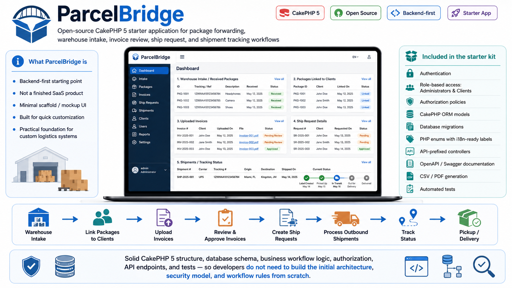

# ParcelBridge: CakePHP 5 App for Package Forwarding and Shipment Workflows

[](https://github.com/salines/parcelbridge/actions/workflows/ci.yml)
[](https://www.php.net)
[](https://cakephp.org)
[](LICENSE)



ParcelBridge is an open-source CakePHP 5 starter application for developers building package forwarding, warehouse intake, invoice review, ship request, and shipment tracking workflows.

The project is designed as a backend-first starting point, not as a finished SaaS product. Its focus is a solid CakePHP 5 structure, database schema, business workflow logic, authorization, API endpoints, and automated tests. The user interface is intentionally minimal and scaffold/mockup-style, so the workflow can be tested, extended, and adapted quickly for a specific business case.

The application covers the core logistics flow: receiving packages at a warehouse, linking packages to clients, uploading invoices, reviewing and approving invoices, creating ship requests, processing outbound shipments, and tracking package status through pickup or delivery.

The starter kit includes authentication, role-based access for administrators and clients, authorization policies, CakePHP ORM models, database migrations, PHP enums with i18n-ready labels, API-prefixed controllers, OpenAPI/Swagger documentation, CSV/PDF generation, and tests for the critical business logic.

ParcelBridge is intended for developers who want a practical foundation for a custom logistics system without having to build the initial architecture, security model, and workflow rules from scratch.

## Stack

- CakePHP 5
- PHP 8.3
- MariaDB 10.11
- Apache via DDEV `apache-fpm`
- CakePHP Migrations
- CakePHP Authentication
- CakePHP Authorization
- FriendsOfCake Search
- FriendsOfCake CakePdf with Dompdf
- FriendsOfCake CsvView
- FriendsOfCake Upload

The project was created from the official `cakephp/app` skeleton. DDEV is used so the reviewer can run the same local LAMP-style environment without manual PHP, Apache, or database setup.

## Installation

Prerequisites:

- Docker or [OrbStack](https://orbstack.dev)
- [DDEV](https://ddev.com)

### Via Composer (recommended)

```bash
composer create-project salines/parcelbridge myapp
cd myapp
cp config/.env.ddev config/.env
```

### Via Git clone

```bash
git clone https://github.com/salines/parcelbridge.git myapp
cd myapp
cp config/.env.ddev config/.env
```

Start DDEV:

```bash
ddev start
```

The project has a DDEV `post-start` hook that automatically runs dependency installation, database migrations, and demo seed data when the database is empty. The seed is skipped on later starts if users already exist.

Manual setup commands are still available if you want to run them explicitly:

```bash
ddev composer install
ddev exec bin/cake migrations migrate
```

To reset the demo data intentionally, run:

```bash
ddev exec bin/cake seeds run InitSeed --force
```

Open the app:

```text
https://parcelbridge.ddev.site
```

If DDEV reports that the same project root was previously registered under another project name, unlist the old project name and start again:

```bash
ddev stop --unlist <old-project-name>
ddev start
```

## Demo Accounts

Admin:

```text
Email: admin@parcelbridge.test
Password: password123
URL: https://parcelbridge.ddev.site/login
```

Client:

```text
Email: client@parcelbridge.test
Password: password123
URL: https://parcelbridge.ddev.site/login
```

## MVP Workflow

Admin portal:

- Dashboard: `/admin`
- Package intake: `/admin/packages/add`
- All packages: `/admin/packages`
- Package CSV export: `/admin/packages/export-csv`
- Dynamic package PDF: `/admin/packages/document/{id}`
- Invoice review queue: `/admin/invoices`
- Ship requests: `/admin/ship-requests`
- Ship requests CSV export: `/admin/ship-requests/export-csv`
- Dynamic ship request manifest PDF: `/admin/ship-requests/manifest/{id}`
- Clients: `/admin/clients`

Client portal:

- Dashboard: `/client`
- My packages: `/client/packages`
- Package CSV export: `/client/packages/export-csv`
- Dynamic package PDF: `/client/packages/document/{id}`
- Upload invoice: available from package detail for packages in `Ready to Send` or `Needs Review`
- Create ship request: `/client/ship-requests/add`
- Ship request CSV export: `/client/ship-requests/export-csv`
- Dynamic ship request manifest PDF: `/client/ship-requests/manifest/{id}`
- Shipment status: `/client/shipments`

## Seed Data

`InitSeed` creates:

- one admin user
- one client user
- one client profile
- demo packages in multiple workflow statuses
- demo invoice records
- demo PDF invoice files in `resources/pdf/invoices`
- a processed demo ship request
- package status history rows

Demo invoice files are intentionally small PDF files committed with the MVP so the admin invoice “Open File” flow works immediately after seeding.

## Documents and Exports

Invoice files are private application documents, not public web assets. They are stored outside `webroot` under:

```text
resources/pdf/invoices
```

The committed demo invoice PDFs live in the same private resources folder so the seeded invoice review flow works immediately after checkout. Uploaded invoice files use the same storage location and are served only through authorized controller actions.

The app also generates operational documents dynamically:

- package PDF documents for admin and client package detail screens
- ship request manifest PDFs for admin and client ship request detail screens
- CSV exports for package and ship request index screens

PDF generation uses `friendsofcake/cakepdf` with `dompdf/dompdf` so the feature works inside DDEV without installing external binaries. CSV generation uses `friendsofcake/cakephp-csvview`, which follows CakePHP view-class conventions instead of hand-building CSV strings in controllers.

Client CSV exports are scoped through Authorization policy scopes, so clients only export their own records. Admin exports include all matching records.

## Domain Model

Main tables:

- `users`
- `clients`
- `packages`
- `invoices`
- `ship_requests`
- `packages_ship_requests`
- `package_status_histories`

The initial schema is defined in:

```text
config/Migrations/20260508000000_Init.php
```

Enums are defined in:

```text
src/Model/Enum
```

Enum labels are i18n-ready via `label()` methods using CakePHP `__()`.

## Authentication and Authorization

Authentication uses `cakephp/authentication`.

Authorization uses `cakephp/authorization` with:

- request-level portal access through `RequestPolicy`
- ORM resource policies for packages, invoices, ship requests, clients, and users
- strict authorization middleware enabled

Clients are scoped to their own packages, invoices, and ship requests. Admin users can access the admin portal and manage the MVP workflow.

## API Documentation

The API is documented with a local OpenAPI spec and local Swagger UI assets.

```text
https://parcelbridge.ddev.site/swagger-ui/
https://parcelbridge.ddev.site/api/openapi.json
```

The API currently uses the same session authentication as the CakePHP app. In Swagger UI, call `POST /api/login` first, then use the other endpoints in the same browser session.

## Workflow Integrity

Package status transitions are enforced server-side in:

```text
src/Model/Table/PackagesTable.php
```

Ship request submission rules are enforced server-side in:

```text
src/Model/Table/ShipRequestsTable.php
```

Covered behavior includes:

- packages cannot skip required lifecycle steps
- status changes write audit rows to `package_status_histories`
- ship requests require at least one approved package
- submitted ship request packages move to `Ship Requested`
- processed ship request packages move to `Shipped`

## Tests

Run the test suite:

```bash
ddev exec vendor/bin/phpunit
```

Run static analysis:

```bash
ddev exec composer stan
```

Run code style checks:

```bash
ddev exec composer cs-check
```

Automatically fix supported code style issues:

```bash
ddev exec composer cs-fix
```

## Known Limitations

- UI uses CakePHP baked templates with targeted MVP workflow cleanup, not a polished custom design.
- Client registration is not implemented because it is out of scope for the MVP.
- Email notifications, payments, and production deployment are out of scope.

## License

ParcelBridge is open-source software licensed under the MIT License. See [LICENSE](LICENSE).
